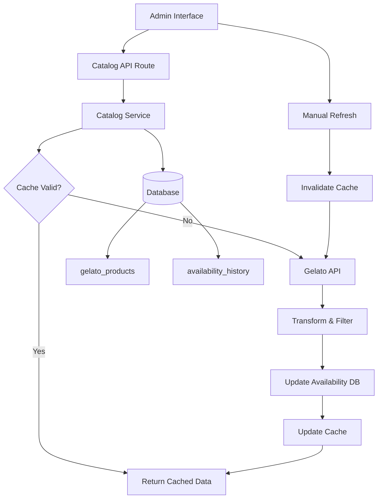

# Design Document: Gelato Catalog Expansion

## Overview

This design expands the Gelato product catalog system to display 50+ products instead of 7, implements a 24-hour caching layer to improve performance, tracks product availability status in the database, and provides visual status indicators in the admin interface. The solution balances API rate limits with data freshness while maintaining backward compatibility with existing product validation and ordering workflows.

## Architecture

### High-Level Architecture



### Component Interaction Flow

1. **Initial Load**: Admin visits `/admin/products/new` → Catalog API checks cache → If expired, fetches from Gelato → Updates database → Returns data
2. **Cached Load**: Admin visits page → Catalog API finds valid cache → Returns cached data immediately
3. **Manual Refresh**: Admin clicks refresh → Cache invalidated → Fresh fetch from Gelato → Database updated → New cache created
4. **Availability Tracking**: Each fetch compares new data with database → Status changes recorded in history table

## Components and Interfaces

### 1. Catalog Service (`lib/services/catalogService.ts`)

**Purpose**: Centralized service for managing product catalog data, caching, and availability tracking.

**Interface**:
```typescript
interface CatalogService {
  // Fetch catalog with caching
  getCatalog(options?: CatalogOptions): Promise<CatalogResponse>
  
  // Force refresh from Gelato API
  refreshCatalog(): Promise<CatalogResponse>
  
  // Get availability status for products
  getProductAvailability(productUids: string[]): Promise<AvailabilityMap>
  
  // Update product availability in database
  updateAvailability(products: GelatoProduct[]): Promise<void>
}

interface CatalogOptions {
  forceRefresh?: boolean
  includeDiscontinued?: boolean
}

interface CatalogResponse {
  products: EnrichedProduct[]
  metadata: {
    totalCount: number
    cachedAt: Date | null
    source: 'cache' | 'api'
  }
}

interface EnrichedProduct extends GelatoProduct {
  availabilityStatus: AvailabilityStatus
  lastSeen: Date
  isNew: boolean
}

type AvailabilityStatus = 'new' | 'available' | 'out_of_stock' | 'discontinued'

interface AvailabilityMap {
  [productUid: string]: {
    status: AvailabilityStatus
    lastSeen: Date
    createdAt: Date
  }
}
```

**Key Methods**:

- `getCatalog()`: Main entry point that checks cache validity, fetches if needed, enriches with availability data
- `refreshCatalog()`: Bypasses cache, forces fresh fetch, updates all tracking data
- `updateAvailability()`: Compares fetched products with database, detects status changes, records history
- `getProductAvailability()`: Queries database for current availability status of specified products

### 2. Cache Manager (`lib/services/cacheManager.ts`)

**Purpose**: Handles cache storage, retrieval, and expiration logic.

**Interface**:
```typescript
interface CacheManager {
  get<T>(key: string): Promise<CachedData<T> | null>
  set<T>(key: string, data: T, ttl: number): Promise<void>
  invalidate(key: string): Promise<void>
  isValid(key: string): Promise<boolean>
}

interface CachedData<T> {
  data: T
  cachedAt: Date
  expiresAt: Date
}
```

**Implementation Strategy**:
- Use in-memory cache with Redis-compatible interface for future scalability
- Store as JSON in a simple key-value structure
- TTL: 24 hours (86400 seconds)
- Cache key: `gelato:catalog:v1`

### 3. Gelato Service Updates (`lib/services/gelatoService.ts`)

**Current State**: Has `getProductCatalog()` with aggressive exclude keywords list

**Changes Needed**:
```typescript
// BEFORE (lines 175-185)
const excludeKeywords = [
  'hat', 'cap', 'beanie',
  'bag', 'tote', 'backpack',
  'mug', 'cup', 'bottle',
  'poster', 'print', 'canvas',
  'sticker', 'decal',
  'phone case', 'iphone', 'samsung'
]

// AFTER - Relaxed filtering
const excludeKeywords = [
  'gift card', 'voucher',
  'sample pack', 'test product',
  'discontinued', 'legacy'
]
```

**New Method**:
```typescript
async function getExpandedProductCatalog(): Promise<GelatoProduct[]> {
  // Fetch all products with minimal filtering
  // Apply only essential exclusions
  // Return 50+ unique product types
}
```

### 4. Database Schema

**New Table: `gelato_products`**
```sql
CREATE TABLE gelato_products (
  uid VARCHAR(255) PRIMARY KEY,
  name VARCHAR(500) NOT NULL,
  type VARCHAR(100) NOT NULL,
  status VARCHAR(50) NOT NULL DEFAULT 'available',
  last_seen TIMESTAMP NOT NULL DEFAULT NOW(),
  created_at TIMESTAMP NOT NULL DEFAULT NOW(),
  updated_at TIMESTAMP NOT NULL DEFAULT NOW(),
  metadata JSONB
);

CREATE INDEX idx_gelato_products_status ON gelato_products(status);
CREATE INDEX idx_gelato_products_last_seen ON gelato_products(last_seen);
```

**New Table: `gelato_availability_history`**
```sql
CREATE TABLE gelato_availability_history (
  id SERIAL PRIMARY KEY,
  product_uid VARCHAR(255) NOT NULL REFERENCES gelato_products(uid),
  status VARCHAR(50) NOT NULL,
  changed_at TIMESTAMP NOT NULL DEFAULT NOW(),
  notes TEXT,
  CONSTRAINT fk_product FOREIGN KEY (product_uid) REFERENCES gelato_products(uid) ON DELETE CASCADE
);

CREATE INDEX idx_availability_history_product ON gelato_availability_history(product_uid);
CREATE INDEX idx_availability_history_changed_at ON gelato_availability_history(changed_at);
```

### 5. API Route Updates (`app/api/gelato/catalog/route.ts`)

**Current Behavior**: Fetches from Gelato API on every request, transforms and groups products

**New Behavior**:
```typescript
export async function GET(request: Request) {
  const { searchParams } = new URL(request.url)
  const forceRefresh = searchParams.get('refresh') === 'true'
  
  try {
    const catalogService = new CatalogService()
    const result = await catalogService.getCatalog({ forceRefresh })
    
    return NextResponse.json({
      success: true,
      data: result.products,
      metadata: result.metadata
    })
  } catch (error) {
    // Return stale cache if available
    // Log error for monitoring
    return NextResponse.json({
      success: false,
      error: 'Failed to fetch catalog'
    }, { status: 500 })
  }
}
```

### 6. Admin UI Updates (`app/admin/products/new/page.tsx`)

**New Features**:
- Status badge component for each product
- Manual refresh button in header
- Loading states for refresh operation
- Product count display

**Status Badge Component**:
```typescript
interface StatusBadgeProps {
  status: AvailabilityStatus
}

function StatusBadge({ status }: StatusBadgeProps) {
  const styles = {
    new: 'bg-blue-100 text-blue-800 border-blue-300',
    available: 'bg-green-100 text-green-800 border-green-300',
    out_of_stock: 'bg-yellow-100 text-yellow-800 border-yellow-300',
    discontinued: 'bg-red-100 text-red-800 border-red-300 opacity-60'
  }
  
  const labels = {
    new: 'New',
    available: 'Available',
    out_of_stock: 'Out of Stock',
    discontinued: 'Discontinued'
  }
  
  return (
    <span className={`px-2 py-1 text-xs rounded border ${styles[status]}`}>
      {labels[status]}
    </span>
  )
}
```

## Data Models

### EnrichedProduct

Extends the existing `GelatoProduct` type with availability information:

```typescript
interface EnrichedProduct extends GelatoProduct {
  // Existing GelatoProduct fields
  uid: string
  title: string
  description: string
  variants: ProductVariant[]
  
  // New availability fields
  availabilityStatus: AvailabilityStatus
  lastSeen: Date
  isNew: boolean
  statusChangedAt?: Date
}
```

### CacheEntry

Represents cached catalog data:

```typescript
interface CacheEntry {
  products: GelatoProduct[]
  cachedAt: Date
  expiresAt: Date
  version: string // For cache invalidation on schema changes
}
```

### AvailabilityRecord

Database record for product availability:

```typescript
interface AvailabilityRecord {
  uid: string
  name: string
  type: string
  status: AvailabilityStatus
  lastSeen: Date
  createdAt: Date
  updatedAt: Date
  metadata?: Record<string, any>
}
```

### AvailabilityHistoryRecord

Historical tracking of status changes:

```typescript
interface AvailabilityHistoryRecord {
  id: number
  productUid: string
  status: AvailabilityStatus
  changedAt: Date
  notes?: string
}
```

## Correctness Properties

*A property is a characteristic or behavior that should hold true across all valid executions of a system—essentially, a formal statement about what the system should do. Properties serve as the bridge between human-readable specifications and machine-verifiable correctness guarantees.*


### Property 1: Minimum Product Variety

*For any* catalog load, the returned product list should contain at least 50 unique product types (identified by distinct product UIDs).

**Validates: Requirements 1.1**

### Property 2: Variant Grouping Preservation

*For any* set of product variants with the same base product identifier, the grouping logic should combine them into a single product entry with multiple variant options.

**Validates: Requirements 1.4**

### Property 3: Valid Product UIDs

*For any* product displayed in the catalog, its UID should pass Gelato API validation.

**Validates: Requirements 1.5, 7.1, 7.2**

### Property 4: Cache Serves Within TTL

*For any* catalog request made within 24 hours of the last fetch, the system should serve data from cache without making an API call, and the response time should be under 1 second.

**Validates: Requirements 2.2, 2.4, 6.3**

### Property 5: Cache Metadata Completeness

*For any* cached catalog entry, it should contain metadata fields: cachedAt timestamp, expiresAt timestamp, and version identifier.

**Validates: Requirements 2.5**

### Property 6: Product Availability Recording

*For any* product fetched from Gelato API, a corresponding record should exist in the gelato_products table with uid, name, type, status, and last_seen fields populated.

**Validates: Requirements 3.1**

### Property 7: Discontinued Product Detection

*For any* product that exists in the database but is absent from the latest Gelato API response, its status should be updated to "discontinued".

**Validates: Requirements 3.3**

### Property 8: New Product Detection

*For any* product returned by Gelato API that does not exist in the gelato_products table, it should be inserted with status "new".

**Validates: Requirements 3.4**

### Property 9: Availability History Tracking

*For any* product status change (from one AvailabilityStatus to another), a record should be inserted into gelato_availability_history with the product_uid, new status, and timestamp.

**Validates: Requirements 3.5, 8.3**

### Property 10: Product Data Preservation

*For any* availability update operation, the product's core fields (uid, name, type, variants) should remain unchanged - only status and last_seen should be modified.

**Validates: Requirements 3.6**

### Property 11: Status Badge Display

*For any* product rendered in the admin interface, the HTML output should contain a status badge element with the product's current availability status.

**Validates: Requirements 4.1**

### Property 12: Discontinued Products Visible

*For any* catalog response, products with status "discontinued" should be included in the returned list (not filtered out).

**Validates: Requirements 4.6**

### Property 13: Refresh Invalidates Cache

*For any* manual refresh operation, the existing cache should be invalidated and a fresh API fetch should occur, regardless of cache TTL.

**Validates: Requirements 5.1, 5.2**

### Property 14: Concurrent Refresh Prevention

*For any* two simultaneous refresh requests, only one should execute the API fetch while the other either waits for completion or receives the result from the first request.

**Validates: Requirements 5.5**

### Property 15: Exponential Backoff on Rate Limits

*For any* sequence of rate limit errors from Gelato API, the retry delays should follow an exponential backoff pattern (e.g., 1s, 2s, 4s, 8s).

**Validates: Requirements 6.1, 6.2**

### Property 16: API Request Logging

*For any* request made to Gelato API, a log entry should be created containing the timestamp, endpoint, and response status.

**Validates: Requirements 6.4**

### Property 17: Shared Cache Across Requests

*For any* two concurrent catalog requests with valid cache, both should receive data from the same cache entry without triggering separate API calls.

**Validates: Requirements 6.5**

### Property 18: Test Mode Filtering

*For any* catalog request when TEST_MODE is disabled, the returned products should only include production-ready products (no test products).

**Validates: Requirements 7.4**

### Property 19: Status-Based Query Filtering

*For any* database query filtering by AvailabilityStatus, the returned products should all have the specified status value.

**Validates: Requirements 8.5**

## Error Handling

### API Failures

**Gelato API Unavailable**:
- Serve stale cache data if available
- Log error with timestamp and details
- Display warning message to admin: "Showing cached data - API temporarily unavailable"
- Retry with exponential backoff on next request

**Rate Limit Exceeded**:
- Implement exponential backoff: 1s, 2s, 4s, 8s, 16s (max 5 retries)
- Log rate limit event for monitoring
- If all retries fail, serve stale cache
- Display message: "Catalog refresh delayed due to API limits"

**Invalid Response Format**:
- Log error with response details
- Serve stale cache if available
- If no cache, return empty catalog with error message
- Alert monitoring system for investigation

### Database Failures

**Connection Errors**:
- Retry database operations up to 3 times with 1s delay
- If database unavailable, serve from cache without availability enrichment
- Log error for monitoring
- Display basic catalog without status badges

**Query Failures**:
- Log error with query details
- Fall back to serving catalog without availability data
- Display products without status indicators
- Retry on next request

### Cache Failures

**Cache Write Failures**:
- Log error but continue serving fresh data
- Attempt to write cache on next request
- Monitor cache write failure rate

**Cache Read Failures**:
- Log error and fetch fresh data from API
- Rebuild cache with fresh data
- Continue normal operation

### Validation Errors

**Invalid Product UID**:
- Exclude product from catalog display
- Log validation failure with product details
- Continue processing remaining products
- Track validation failure rate for monitoring

**Missing Required Fields**:
- Log error with product details
- Exclude incomplete product from catalog
- Continue processing remaining products

## Testing Strategy

### Dual Testing Approach

This feature requires both unit tests and property-based tests for comprehensive coverage:

**Unit Tests**: Focus on specific examples, edge cases, and integration points
- Specific product category inclusion (hats, mugs, etc.)
- Cache expiration at exactly 24 hours
- API failure scenarios with stale cache
- Status badge rendering for each status type
- Database schema validation
- Manual refresh button interaction
- Rate limit error handling

**Property-Based Tests**: Verify universal properties across all inputs
- Minimum 100 iterations per property test
- Each test tagged with: **Feature: gelato-catalog-expansion, Property N: [property text]**
- Properties validate behavior across randomized inputs

### Property-Based Testing Configuration

**Library**: Use `fast-check` for TypeScript/JavaScript property-based testing

**Configuration**:
```typescript
import fc from 'fast-check'

// Example property test structure
describe('Feature: gelato-catalog-expansion', () => {
  it('Property 1: Minimum Product Variety', () => {
    fc.assert(
      fc.asyncProperty(
        fc.anything(), // Arbitrary catalog state
        async (state) => {
          const catalog = await catalogService.getCatalog()
          expect(catalog.products.length).toBeGreaterThanOrEqual(50)
        }
      ),
      { numRuns: 100 }
    )
  })
})
```

**Test Organization**:
- Property tests in `__tests__/properties/catalog-expansion.test.ts`
- Unit tests in `__tests__/unit/catalog-service.test.ts`
- Integration tests in `__tests__/integration/catalog-api.test.ts`

### Coverage Requirements

**Property Tests** (19 properties):
1. Minimum product variety (50+ products)
2. Variant grouping preservation
3. Valid product UIDs
4. Cache serves within TTL
5. Cache metadata completeness
6. Product availability recording
7. Discontinued product detection
8. New product detection
9. Availability history tracking
10. Product data preservation
11. Status badge display
12. Discontinued products visible
13. Refresh invalidates cache
14. Concurrent refresh prevention
15. Exponential backoff on rate limits
16. API request logging
17. Shared cache across requests
18. Test mode filtering
19. Status-based query filtering

**Unit Tests** (examples and edge cases):
- Specific product categories present (Req 1.2)
- First catalog load flow (Req 2.1)
- Cache expiration after 24 hours (Req 2.3)
- Stale cache on API failure (Req 2.6)
- Product becomes unavailable (Req 3.2)
- Status badge styling for each status (Req 4.2-4.5)
- Manual refresh success flow (Req 5.3)
- Manual refresh failure handling (Req 5.4)
- Refresh loading indicator (Req 5.6)
- Database schema validation (Req 8.1, 8.2, 8.4)

### Testing Priorities

**Critical Path** (must pass before deployment):
- Cache functionality (Properties 4, 5, 13)
- Product availability tracking (Properties 6, 7, 8, 9)
- API rate limiting (Property 15)
- Product variety (Property 1)

**Important** (should pass but can be fixed post-deployment):
- UI status indicators (Properties 11, 12)
- Concurrent operations (Properties 14, 17)
- Error handling (unit tests)

**Nice to Have** (can be implemented incrementally):
- Performance benchmarks
- Load testing with multiple admins
- Historical availability analysis
